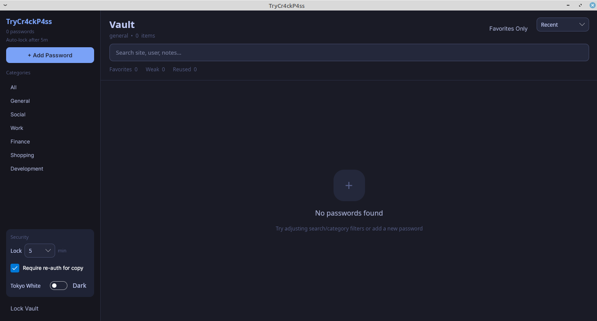

# TryCr4ckP4ss

Local-first desktop password vault built with Avalonia + .NET.

## Status
- Beta quality.
- Personal/offline use first.
- Security-sensitive software: review code before trusting with critical secrets.

## Features
- Encrypted local vault (AES-GCM, PBKDF2).
- Categories, search, favorites, and sorting.
- Password strength + reused-password indicators.
- TOTP code generation and copy.
- Auto-lock on inactivity.
- Re-auth for sensitive actions.
- Dark + Tokyo White themes.
- UI state persistence (`Data/ui-state.json`).

## Quick Start
```bash
cd TryCr4ckP4ss
dotnet restore
dotnet run
```

## AppImage


## Build Docs
- Cross-platform build + publish: [BUILD.md](BUILD.md)
- One command local build: `./build-all.sh`
- GitHub Actions artifact workflow: `.github/workflows/build-artifacts.yml`
- Artifacts are generated on push, tags, PRs, and manual workflow runs.

## Contributing
- See [CONTRIBUTING.md](CONTRIBUTING.md)

## License
- [zlib](LICENSE)
